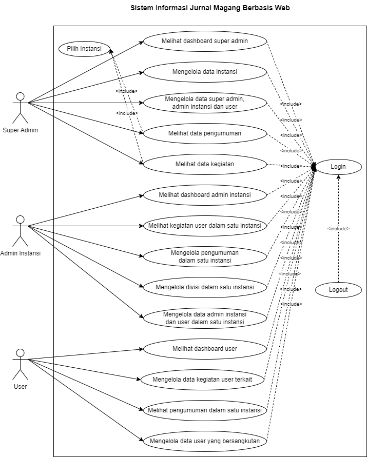

# Sistem Informasi Kemajuan Aktivitas Magang Berbasis Web

&nbsp;&nbsp;&nbsp;&nbsp;&nbsp;&nbsp;&nbsp;&nbsp;&nbsp;&nbsp;&nbsp;&nbsp;&nbsp;&nbsp;&nbsp;Projek Praktek Kerja Lapangan Sistem Informasi Kemajuan Aktivitas Magang Berbasis Web merupakan sebuah aplikasi yang didesain untuk memudahkan antara peserta magang, admin instansi terkait dan super admin dalam melakukan pencatatan kegiatan sehari-hari dalam bentuk digital. Sistem ini akan merekam kegiatan yang ditambahkan oleh peserta magang melalui logbook atau jurnal dan memberikan akses kepada admin instansi yang bersesuain dengan peserta tersebut untuk memantau progres setiap harinya. 

&nbsp;&nbsp;&nbsp;&nbsp;&nbsp;&nbsp;&nbsp;&nbsp;&nbsp;&nbsp;&nbsp;&nbsp;&nbsp;&nbsp;&nbsp;Sistem ini menggunakan database untuk melakukan penyimpanan data diantaranya data user, instansi, divisi, kegiatan dan pengumuman. Setiap data tersebut ditampung ke dalam table-tabel yang saling berelasi. Tabel user berelasi dengan table user detail, user instansi detail dan kegiatan. Table user detail berelasi dengan table divisi, sedangkan table instansi berelasi dengan table pengumuman, user detail, user instansi detail dan divisi. Setiap table dalam database merepresentasikan sidebar menu yang dapat dilakukan pengelolaan oleh user dalam sistem. Untuk mendapatkan hak akses dalam pengelolaan data tersebut, user harus melakukan login terlebih dahulu menggunakan akun yang telah diverifikasi oleh admin instansi user tersebut berasal sehingga tidak semua user yang mendaftar dalam sistem dapat secara langsung masuk ke dalam web. Apabila data yang diinputkan ketika login benar, maka user tersebut akan diarahkan menuju ke dashboard dari level user tersebut yaitu super admin, admin instansi dan user. Super admin memiliki akses secara keseluruhan dalam sistem diantaranya mengelola data instansi, mengelola data super admin, admin instansi dan user, melihat data pengumuman dan melihat data kegiatan. Admin instansi memiliki wewenang untuk melihat kegiatan user dalam satu instansi, mengelola pengumuman dalam satu instansi, mengelola divisi dalam satu instansi dan mengelola data admin instansi dan user dalam instansi. User memiliki akses untuk mengelola data kegiatan user terkait, melihat pengumuman dalam satu instansi dan mengelola data user terkait. Tindakan pengelolaan meliputi kegiatan menambah, mengubah, melihat detail dan menghapus untuk setiap data yang tersimpan dalam database system. Aksi penghapusan data dilengkapi dengan alert untuk memastikan kembali apakah user ingin menghapus data secara permanen.  

## Perancangan Sistem dan Pembuatan Database

Deskripsi urutan perilaku user yang berlangsung dalam sistem dapat tergambar dalam ilustrasi kegiatan secara sistematik. Diagram ini menjelaskan aktivitas yang dapat dilakukan oleh beberapa tipe user dalam sistem diantaranya super admin yang memiliki wewenang untuk melakukan pengelolaan data terhadap seluruh jenis user terdaftar, memonitor data pengumuman dan kegiatan user dari seluruh instansi 

  

## Relasi Antar Tabel Database

Skema relasi merepresentasikan keterkaitan antar objek yang digambarkan dalam bentuk row dan column dalam tabel. Hubungan ini berfungsi untuk mempermudah user dalam proses manajemen data diantaranya pengambilan data menggunakan query yang melibatkan row dari tabel lain yang diacu begitu pula mekanisme update data pada row tabel master yang akan teraplikasi pada tabel yang mereferensi
 

  

## Struktur Tabel Database

&nbsp;&nbsp;&nbsp;&nbsp;&nbsp;Projek Praktek Kerja Lapangan Sistem Informasi Kemajuan Aktivitas Magang Berbasis Web didukung dengan database phpmyadmin yang akan menyimpan seluruh data dalam sistem. Data-data tersebut dikelompokkkan menjadi beberapa table. Dalam satu table hanya terdiri dari data yang memiliki attribute yang serupa, seperti table kegiatan hanya menampung data yang memiliki attribute user, tanggal, deskripsi dan foto. Perincian tiap table dijelaskan sebagai berikut
 

1. Tabel User

    
   
Table User berfungsi untuk menyimpan data user yang akan menggunakan sistem. Attribute dalam table ini diantaranya id_user sebagai primary key, email, password, nip, nama_user, alamat, tanggal_registrasi, foto, tipe_foto, level dan status.
 

2. Tabel User Instansi Detail

    
   
Table user_instansi_detail berfungsi untuk menampung data user yang memiliki level sebagai admin instansi oleh karena itu di dalam table tersebut terdapat foreign key dari table instansi yaitu kolom id_instansi.
 

3. Tabel User Detail

    
   
Table user_detail digunakan untuk menyimpan data yang memiliki detil diluar dari attribute yang disediakan pada table user yang diperuntukkan bagi user dimana user tersebut adalah peserta magang, dalam table tersebut terdapat attribute berupa id_user yang merupakan foreign key dari table user, id_instansi foreign key dari table instansi, id_divisi foreign key dari table divisi, periode_mulai dan periode_selesai.
 

4. Tabel Instansi

    
   
Table instansi merupakan table yang berfungsi untuk menyimpan data instansi yang berpartisipasi dalam magang dan terdaftar dalam sistem. Attribute pada table instansi diantaranya id_instansi yang merupakan primary key, nama_instansi, alamat, deskripsi, email, telp, logo dan status.
 

5. Tabel Divisi

    
   
Table divisi merupakan table yang menyimpan jenis-jenis divisi yang terdapat dalam suatu instansi. Attribute dalam table divisi meliputi id_divisi yang merupakan primary key, id_instansi foreign key dari table instansi, nama, deskripsi dan telp.
 

6. Tabel Pengumuman

    
   
Table pengumuman merupakan table yang digunakan untuk menampung data pengumuman yang dibuat oleh instansi dan dikirim kepada user dalam satu instansi pembuat pengumuman tersbut. Adapun attribute dalam table pengumuman diantaranya id_pengumuman yang merupakan primary key dalam table, id_instansi foreign key dari table instansi, tanggal, judul, isi dan foto. Setiap foreign key yang terdapat dalam suatu table menunjukkan relasi antara table-table yang terhubung.
 

7. Tabel Kegiatan

    
   
Table kegiatan merupakan table yang digunakan untuk menampung data kegiatan yang dibuat oleh user dan dikirim kepada admin instansi. Atribut dalam tabel kegiatan diantaranya id_kegiatan yang merupakan primary key dalam tabel kegiatan ini, id_user foreign key dari tabel user, tanggal_kegiatan, deskripsi_kegiatan, foto, dan tipe_foto. Relasi tersebut digunakan untuk mengambii data yang berasal dari table lain dengan cara menambahkan attribute foreign key dalam table utama.
  

## User Interface

### Super Admin

1. Halaman Login

    
   
Halaman ini menampilkan form login dari sistem, beberapa input field yang diperlukan untuk mengakses sistem diantaranya email dan password. Pengguna baru dapat melakukan pengajuan akun melalui link registrasi akun user baru yang terletak dibawah form. Halaman ini merupakan gerbang utama sebelum user dapat menggunakan hak akses yang dimiliki
 

2. Halaman Dashboard Super Admin

    
   
Halaman ini merupakan tampilan dari halaman utama super admin, dalam main content menampakkan level user dan nama user terkait. Pada menu sidebar memuat dashboard, kegiatan, pengumuman, instansi, dan user. Sisi sebelah kanan dalam header terdapat dropdown profile dan logout button
 

3. Halaman Kegiatan

     
    
   
Halaman Kegiatan Instansi menampilkan list instansi yang telah terdaftar pada sistem, sedangkan Halaman Kegiatan User Instansi menampilkan list data kegiatan yang dilakukan oleh user berdasarkan instansi terpilih pada opsi instansi
 

4. Halaman Pengumuman

     
    
   
Halaman pengumuman pertama menampilkan list instansi yang telah terdaftar pada sistem, sedangkan halaman pengumuman berikutnya menunjukkan list pengumuman yang telah dilakukan posting oleh instansi terkait meliputi tanggal, pukul, asal instansi dan judul. Button detil digunakan untuk menampilkan floating modal berisi deskripsi dan foto penunjang pengumuman
 

5. Halaman Instansi

    
   
Halaman ini menampilkan list seluruh instansi yang telah terdaftar baik dengan status telah terverifikasi maupun dalam proses. Beberapa field yang tersedia diantaranya no, nama, alamat, deskripsi, email, telepon, logo, status dan aksi. Button ubah status, hapus dan ubah dan tambah memiliki fungsi tersendiri dalam pengelolaan data instansi.
 

6. Halaman User Super Admin

    
   
Halaman ini menampilkan list seluruh super admin yang telah terdaftar baik dengan status telah terverifikasi maupun dalam proses. Beberapa field yang tersedia diantaranya no, email, nip, nama, alamat, tanggal registrasi, foto, level, status dan aksi. Button ubah status, hapus dan ubah dan tambah memiliki fungsi tersendiri dalam pengelolaan data super admin.
 

7. Halaman User Admin Instansi

    
   
Halaman ini menampilkan list seluruh user admin instansi yang telah terdaftar dari seluruh instansi dalam sistem baik dengan status telah terverifikasi maupun dalam proses. Beberapa field yang tersedia diantaranya no, email, nip, nama, alamat, tanggal registrasi, foto, level, status dan aksi. Button ubah status, hapus dan ubah dan tambah memiliki fungsi tersendiri dalam pengelolaan data admin instansi.
 

8. Halaman User

    
   
Halaman ini menampilkan list seluruh user yang telah terdaftar dari seluruh instansi dalam sistem baik dengan status telah terverifikasi maupun dalam proses. Beberapa field yang tersedia diantaranya no, email, nip, nama, alamat, tanggal registrasi, foto, level, status dan aksi. Button ubah status, hapus dan ubah dan tambah memiliki fungsi tersendiri dalam pengelolaan data user.
 

### Admin Instansi

1. Halaman Dashboard Admin Instansi

    
   
Halaman ini merupakan tampilan dari halaman utama admin instansi, dalam main content menampakkan level user dan nama user dan asal instansi terkait. Pada menu sidebar memuat dashboard, kegiatan, pengumuman, divisi, dan user. Sisi sebelah kanan dalam header terdapat dropdown profile dan logout button
 

2. Halaman Kegiatan

     
    
   
Halaman Kegiatan User menampilkan list kegiatan yang telah tercatat pada sistem secara keseluruhan berdasarkan instansi yang menaungi admin terkait, sedangkan Halaman Sub Kegiatan User menampilkan rekap data kegiatan yang dilakukan oleh user berdasarkan instansi terkait setiap bulan
 

3. Halaman Pengumuman

    
   
Halaman pengumuman menampilkan list pengumuman yang telah dilakukan posting oleh admin instansi terkait meliputi tanggal, pukul, asal instansi dan judul. Pengumuman akan muncul pada user yang dibawahi oleh instansi yang bersesuaian. Pada kolom aksi terdapat fitur CRUD (Create, Read, Update, Delete) yang direpresentasikan oleh button hapus, ubah, detil dan tambah. Button detil digunakan untuk menampilkan floating modal berisi deskripsi dan foto penunjang pengumuman
 

4. Halaman Divisi

    
   
Halaman ini menampilkan list divisi yang ada berada dalam naungan instansi terkait meliputi no, asal instansi, divisi, deskripsi, telp dan aksi. Divisi yang telah ditambahkan akan muncul dalam list divisi pada halaman registrasi user baru dalam dropdown pilih nama divisi. Pada kolom aksi terdapat fitur CRUD (Create, Read, Update, Delete) yang direpresentasikan oleh button hapus, ubah, detil dan tambah.
 

5. Halaman User Admin Instansi

    
   
Halaman ini menampilkan list seluruh user admin instansi yang telah terdaftar dan berada dalam satu naungan instansi terkait. Beberapa field yang tersedia diantaranya no, email, nip, nama, alamat, tanggal registrasi, foto, level, status dan aksi. Pada kolom aksi terdapat fitur CRUD (Create, Read, Update, Delete) yang direpresentasikan oleh button hapus, ubah, detil dan tambah yang memiliki fungsi tersendiri dalam pengelolaan data user admin instansi.
 

6. Halaman User

    
   
Halaman ini menampilkan list seluruh user yang telah terdaftar dan berada dalam satu naungan instansi terkait baik dengan status telah terverifikasi maupun dalam proses. Beberapa field yang tersedia diantaranya no, email, nip, nama, alamat, tanggal registrasi, foto, level, status dan aksi. Pada kolom aksi terdapat fitur CRUD (Create, Read, Update, Delete) yang direpresentasikan oleh button hapus, ubah, detil dan tambah yang memiliki fungsi tersendiri dalam pengelolaan data user.
 

### User

1. Halaman Registrasi

     
    
   
Halaman ini berfungsi untuk pengajuan pembuatan user baru dalam sistem. Form pada halaman registrasi awal meliputi input field email akun user, password akun user, nip, nama user, alamat user, tanggal registrasi akun(otomatis terisi), dan foto user. Halaman registrasi berikutnya menampilkan form berisi input field dropdown pilih asal instansi, dropdown pilih nama divisi, peiode mulai dan periode selesai. User yang telah mengajukan pembuatan akun baru akan dilakukan verifikasi oleh admin instansi yang bersesuaian dengan asal instansi untuk mendapatkan hak akses terhadap sistem
 

2. Halaman Dashboard User

    
   
Halaman ini merupakan tampilan dari halaman utama user, dalam main content menampakkan level user, nama user, asal divisi dan asal instansi terkait. Pada menu sidebar memuat dashboard, kegiatan, pengumuman dan user. Sisi sebelah kanan dalam header terdapat dropdown profile dan logout button
 

3. Halaman Kegiatan

    
   
Halaman Kegiatan menampilkan list kegiatan yang telah ditambahkan oleh user terkait pada sistem meliputi no, tanggal, pukul, nama, deskripsi foto dan aksi. Pada kolom aksi terdapat fitur CRUD (Create, Read, Update, Delete) yang direpresentasikan oleh button hapus, ubah, detil dan tambah yang memiliki fungsi tersendiri dalam pengelolaan data kegiatan user terkait.
 

4. Halaman Pengumuman

     
    
   
Halaman pengumuman menampilkan list pengumuman yang telah dilakukan posting oleh admin instansi terkait meliputi tanggal, pukul, asal instansi dan judul. Pengumuman yang muncul hanya berasal dari admin instansi yang bersesuaian denga nasal instansi user. Button detil pada kolom aksi digunakan untuk menampilkan floating modal berisi deskripsi dan foto penunjang pengumuman
 

5. Halaman User

    
   
Halaman ini menampilkan data user yang bersangkutan meliputi email, nip, nama, alamat, tanggal registrasi, foto, level, status dan aksi. Pada kolom aksi user dapat melakukan update data menggunakan button ubah dan memeriksa rincian data melalui button detil
 

## Kesimpulan

&nbsp;&nbsp;&nbsp;&nbsp;&nbsp;Projek Praktek Kerja Lapangan Sistem Informasi Kemajuan Aktivitas Magang Berbasis Web merupakan aplikasi log aktivitas atau jurnal harian peserta magang untuk mendokumentasikan kegiatan yang telah dilakukan pada saat magang berlangsung. Secara garis besar terdapat tiga jenis pengguna yang dapat mengakses aplikasi ini yaitu super admin, admin instansi dan user. User dapat menambahkan aktivitas baru berupa deskripsi kegiatan dan lampiran foto kegiatan tersebut. Admin Instansi dapat melihat kegiatan user tersebut melalui website sehingga kegiatan yang dilakukan user dapat terpantau perkembangannya melalui log history kegiatan. Admin Instansi yang ingin mendaftarkan instansi asal dapat mengajukan registrasi instansi baru dan menunggu verifikasi dari super admin untuk mendapatkan akses ke dalam website, begitu pula verifikasi yang diberikan admin instansi kepada user ketika registrasi user baru. Berbagai kemudahan dapat dirasakan oleh semua pengguna dengan aplikasi ini ketika aktivitas yang dilakukan oleh user dapat terpantau secara digital dan real-time ketika user sedang melakukan akses pada website

